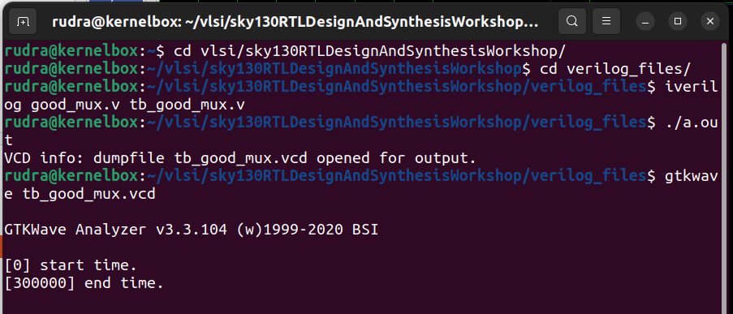
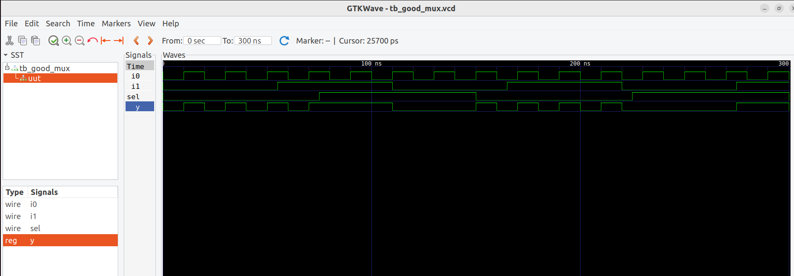
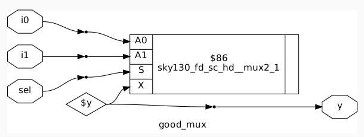

# 🚀 RISC-V SoC Tapeout Workshop — Week 1, Day 1

> *Understanding Verilog Simulation & Synthesis with a Simple Multiplexer*

This repository captures the foundational steps taken on **Day 1 of Week 1** in the RISC-V SoC Tapeout Workshop. I simulated, verified, and synthesized a basic 2:1 multiplexer (`good_mux.v`) using open-source tools.

---

## 📁 Directory Contents

- `commands.png` — Terminal commands used for simulation and waveform viewing.
- `netlist.png` — Gate-level netlist representation after synthesis.
- `waveform.png` — GTKWave visualization of testbench results.

---

## 🎯 Objective

To:
- Understand Verilog design and testbench structure.
- Simulate the `good_mux.v` module using Icarus Verilog.
- Visualize signal behavior via GTKWave.
- Generate and interpret the synthesized netlist using SkyWater 130nm PDK.

---

## ⚙️ Simulation Workflow

### 1. Compile Design & Testbench and obtain the waveform

```bash
iverilog good_mux.v tb_good_mux.v
./a.out
gtkwave tb_good_mux.vcd
```



### 2. Obtain the Netlist reprenstation 

Use yosys to obtain the netlist representation of good_mux.v

