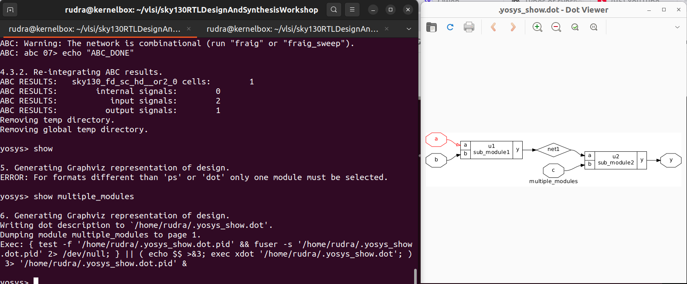
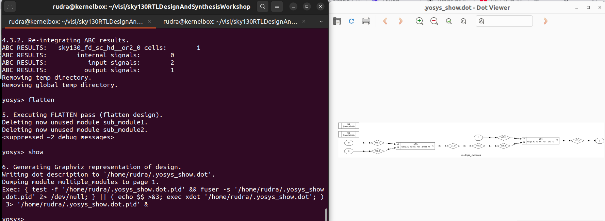
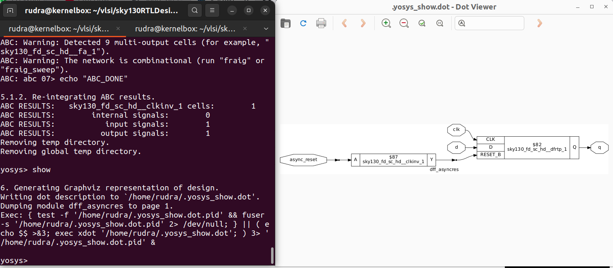
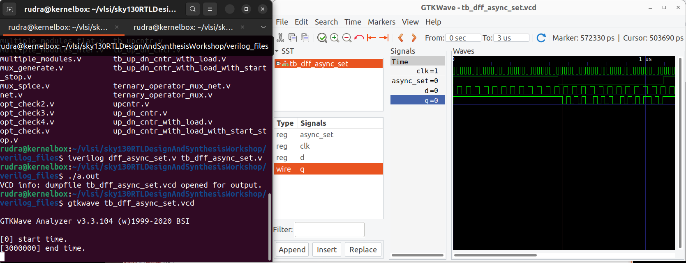

# DAY2 : Flat vs. Hierarchical Synthesis and Common RTL Coding Styles

## Flat vs. Hierarchical Synthesis

### Flat Synthesis
- The entire design is **read as a single unit**, and all hierarchy is **collapsed** during synthesis.
- The synthesis tool optimizes across module boundaries, treating the design as one large netlist.

### Hierarchical Synthesis
- The design is synthesized **module-by-module**, preserving the original hierarchy.
- Each sub-module is synthesized independently, and results are integrated at the top level.

### Without Flattening



### Aftern Flatten


### When to Use Which?
- **Flat synthesis**: Best for small to medium designs, or when timing closure is critical and global optimization is needed.
- **Hierarchical synthesis**: Preferred for large SoCs, IP reuse, or when design teams work on separate blocks in parallel.


## Common RTL Coding Styles

Consistent and synthesizable coding styles are essential for predictable synthesis results and avoiding unintended latches or timing issues.

### Asynchronous Reset (`async_reset`)
- Active-low or active-high reset that **takes effect immediately**, independent of the clock edge.
- Must be included in the sensitivity list of the `always` block.
- **Recommended style** (active-low reset):

```verilog
always @(posedge clk or negedge rst_n) begin
    if (!rst_n)
        q <= 1'b0;
    else
        q <= d;
end
```



### Asynchronous Set (`async_set`)
- Similar to async reset, but forces the flop to a logic high.
- **Recommended style** (active-low reset):

```verilog
always @(posedge clk or posedge set) begin
    if (set)
        q <= 1'b1;
    else
        q <= d;
end

