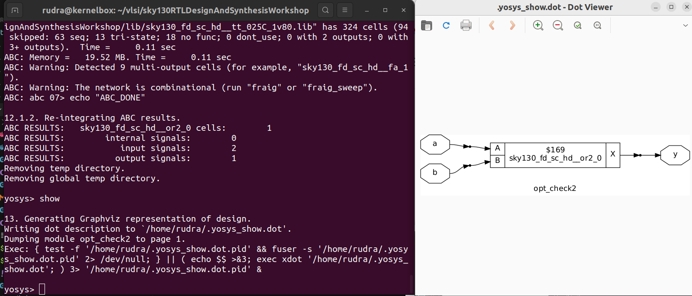
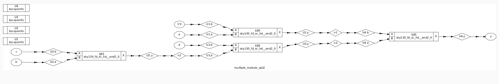
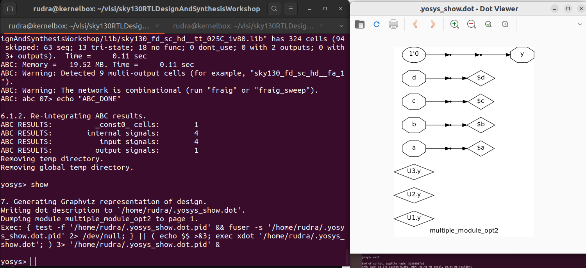
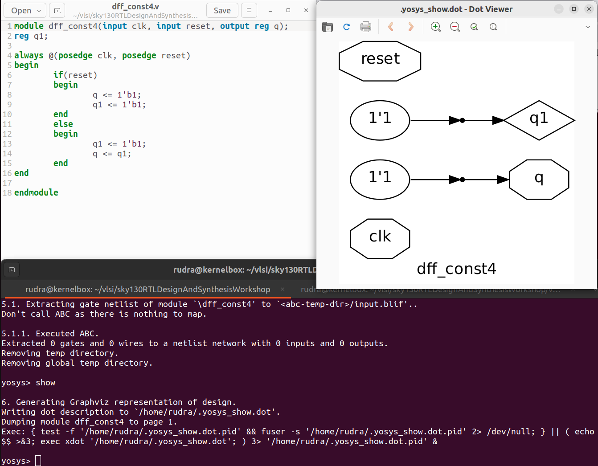
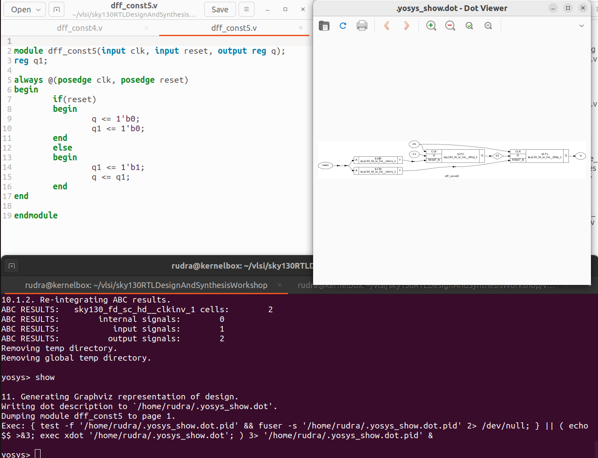
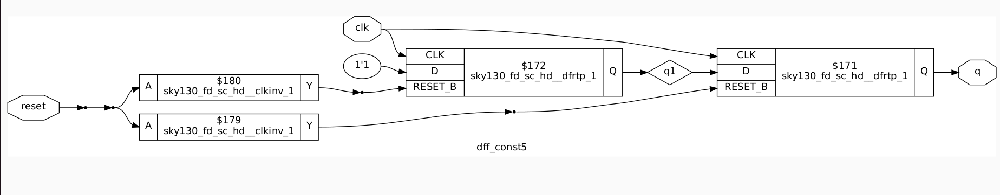

# Logic Optimizations in Yosys Synthesizer

Yosys is an open-source logic synthesis tool that converts RTL (Verilog) designs into gate-level netlists.  
During synthesis, Yosys performs **logic optimizations** to simplify and improve the circuit while preserving functionality.

This document explains the key types of logic optimizations supported by Yosys and how to run them.

---

## 1️⃣ Types of Logic Optimizations

### 1. Constant Propagation
### 2. Boolean Logic Optimization
### 3. Sequential Logic Optimization

Apart from that, there are some standard optimizations like optimization of Unused Outputs, Optimization of Constant Inputs etc.


```bash
# 1. Read the Sky130 Liberty timing/power library
read_liberty lib/sky130_fd_sc_hd__tt_025C_1v80.lib

# 2. Read your Verilog design
read_verilog verilog_files/opt_check2.v

# 3. Run generic synthesis and set the top module
synth -top opt_check2

# 4. Perform cleanup and optimizations
opt_clean -purge   # removes unused wires/cells and performs extra optimizations

# 5. Map logic to Sky130 standard cells using ABC
abc -liberty lib/sky130_fd_sc_hd__tt_025C_1v80.lib
```











### For D Flip Flops:


```bash
# 1. Read the Sky130 Liberty timing/power library
read_liberty lib/sky130_fd_sc_hd__tt_025C_1v80.lib

# 2. Read your Verilog design
read_verilog verilog_files/opt_check2.v

# 3. Run generic synthesis and set the top module
synth -top opt_check2

#Maps the cells with the standard D FF cells
dfflibmap -liberty lib/sky130_fd_sc_hd__tt_025C_1v80.lib

# 5. Map logic to Sky130 standard cells using ABC
abc -liberty lib/sky130_fd_sc_hd__tt_025C_1v80.lib
```






