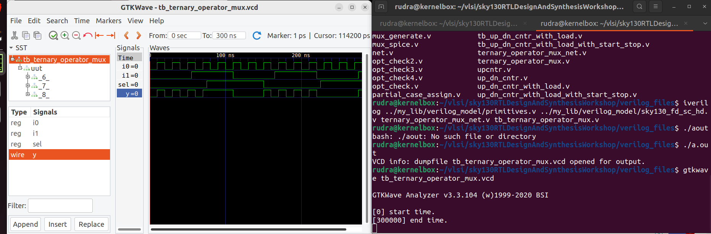
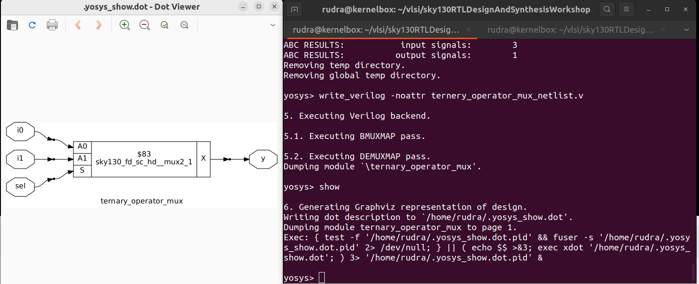
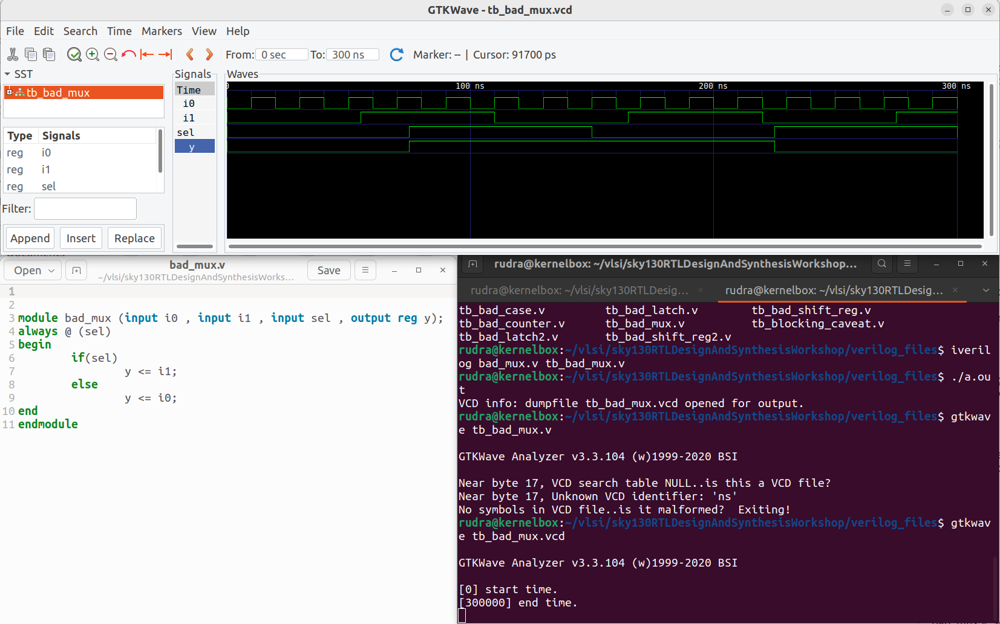
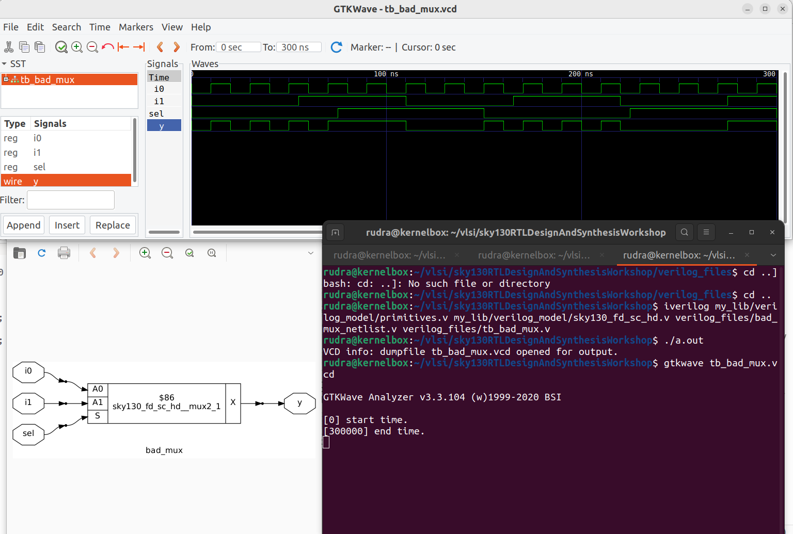
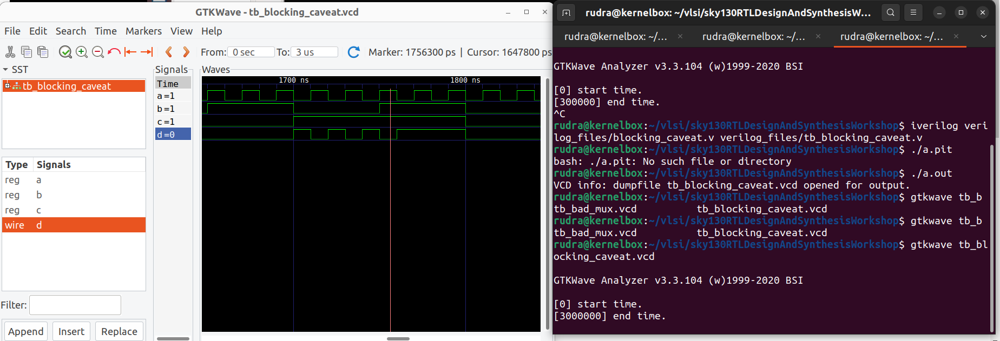
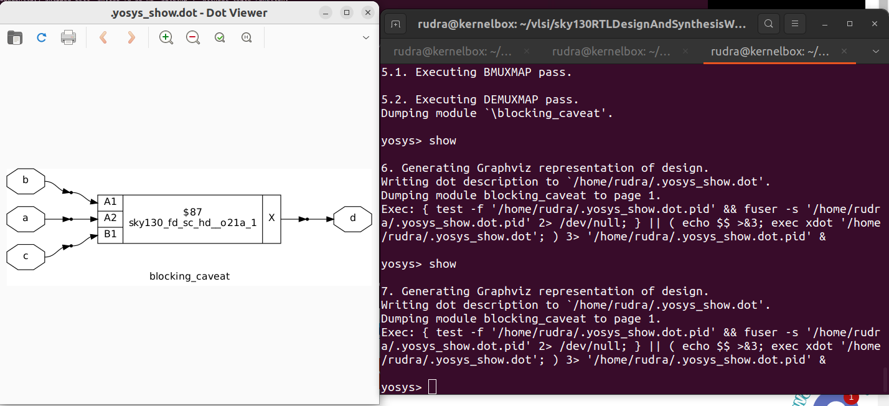
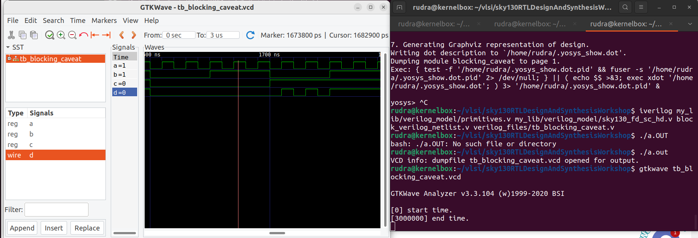

# Gate-Level Simulation (GLS)

## What is GLS?

Gate-Level Simulation (GLS) is a verification technique in which testbenches are run against a **gate-level netlist**—the structural representation of a design after logic synthesis—instead of the original Register Transfer Level (RTL) code. The netlist consists of standard cells (e.g., AND, OR, DFF) from a target technology library and reflects the actual hardware implementation. 

## Why Perform GLS?

GLS serves two essential purposes in the digital design verification flow:

1. **Functional Verification at Gate Level**  
   Ensures that the synthesized netlist behaves functionally identically to the original RTL under the same stimulus.

2. **Timing Verification**  
   Validates correct operation under real-world timing conditions by simulating with actual gate and interconnect delays, exposing timing-related failures such as setup/hold violations or glitches.

3. **Detection of Synthesis-Simulation Mismatches**  
   Identifies discrepancies between RTL simulation and the synthesized implementation—bugs that pass RTL simulation but fail in hardware.

### Lab: The synthesis of ternery operator (which translates to a mux)

## Common Causes of Synthesis-Simulation Mismatches

### Sensitivity List Issues
In RTL, combinational logic blocks rely on sensitivity lists to trigger re-evaluation during simulation. If the sensitivity list is incomplete or manually specified incorrectly, the simulator may not update outputs when certain inputs change. However, synthesis tools ignore the sensitivity list and infer logic purely from the procedural code. This divergence leads to functional mismatches that only manifest at the gate level.

### RTL design odf bad_mux.v

### Netlist representation of bad_mux.v

### Blocking vs. Non-Blocking Assignments
The simulation semantics of blocking (`=`) and non-blocking (`<=`) assignments differ from how synthesis interprets them. Blocking assignments execute sequentially in simulation, which can create race conditions or unintended data dependencies. Synthesis, by contrast, maps non-blocking assignments to concurrent hardware updates (e.g., flip-flops). Misuse of these assignment types can result in RTL simulations that appear correct but produce incorrect behavior in the synthesized netlist.

We can see that at a=1, b=1, c=1, the value of d = 0. BEcause, the value of a used is obtained from the latch. (Prev Cycle)

### In netlist form

## Importance

GLS is a critical sign-off step before tape-out. It provides the highest confidence that the physical implementation matches both the functional intent and timing behavior of the design. Skipping GLS risks undetected bugs that may lead to silicon failure, costly respins, or field reliability issues.