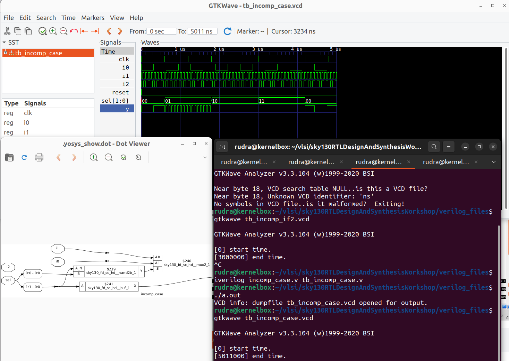

# DAY 5: Conditional Statements and Loops in Verilog

## `if-else` Statements

### Priority Encoding
In Verilog, `if-else` statements are **priority-encoded** during synthesis. This means:
- Conditions are evaluated **sequentially** from top to bottom.
- The first condition that evaluates to true determines the assignment.
- Subsequent `else if` or `else` branches are **not evaluated**, even if their conditions are also true.

This behavior naturally implements a **priority logic structure** in hardware (e.g., a chain of multiplexers), which is useful for control logic but may lead to unintended timing or area overhead if priority is not required.

### Latch Inference in `if-else`
A **latch is inferred** when a signal is **not assigned in all possible execution paths** of a combinational `always` block. This typically occurs when:
- An `if` statement lacks a corresponding `else` (or `else if` chain does not cover all cases).
- The unassigned signal retains its previous value, implying memory—which synthesizes to a latch.

## `case` Statements

### Behavior
The `case` statement evaluates a single expression and executes the block matching the expression value. Unlike `if-else`, `case` implies **parallel evaluation** (no inherent priority), making it ideal for one-hot or mutually exclusive conditions.

### Latch Inference in `case`
A latch is inferred when:
- Not all possible values of the case expression are covered (including the `default` case).
- A signal is not assigned for one or more case items.

Even if all explicitly defined cases are covered, **omitting the `default` clause** can cause latch inference if the case expression can take on **unrepresented or undefined values** (e.g., a 2-bit signal with only three out of four possible values handled).

### How to Avoid Latches
- **Always include a `default` clause** in combinational `case` blocks.
- Assign all outputs in the `default` branch to a known constant or safe value.

### Complete Case Statements

### Incomplete Case statements

### PArtial Case Statements

### `for` Loop (Behavioral)
- Used **inside procedural blocks** such as `always` or `initial`.
- Executes **sequentially during simulation**.
- Generally **not synthesizable** for general-purpose logic; primarily intended for **testbench code** or **simulation initialization**.
- May be synthesizable in limited contexts (e.g., in SystemVerilog `always_comb` for constant-bound loops), but this is not guaranteed in standard Verilog.

### `for-generate` Loop (Structural)
- A **generate construct** used **outside procedural blocks**, at the module level.
- **Unrolls at elaboration time** to create replicated hardware instances or logic.
- Fully **synthesizable** and commonly used to create regular, parallel hardware 
structures.

