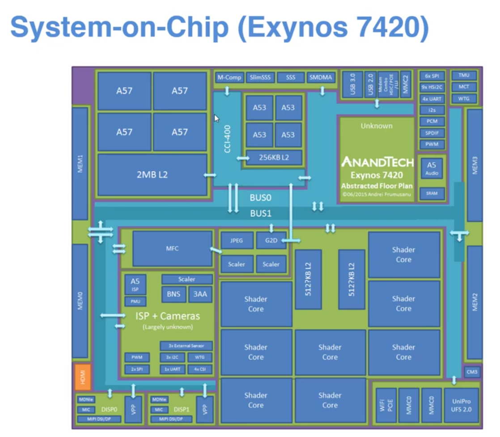
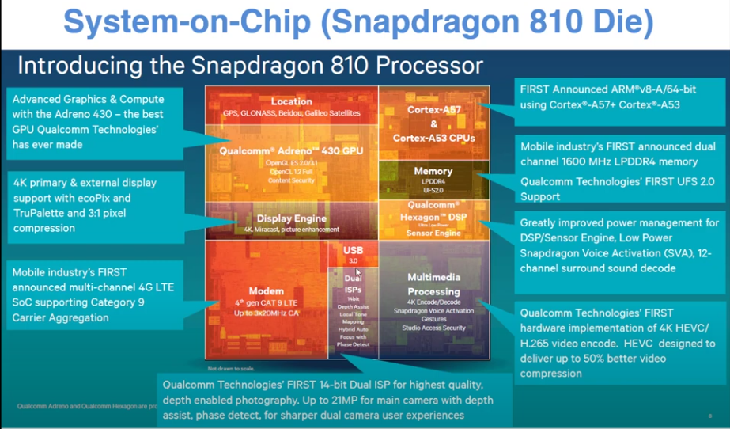

# Fundamentals of SoC Design and BabySoC

## 📌 What is a System-on-Chip (SoC)?
A **System-on-Chip (SoC)** is an integrated circuit that combines the essential components of a complete computer system onto a single silicon chip.  
Unlike traditional systems where CPU, memory, and peripherals are on separate chips, an SoC integrates them into one compact design.  

**Advantages of SoC**
- Smaller size and reduced power consumption (ideal for mobile/IoT devices).  
- Higher performance due to shorter interconnect paths.  
- Lower cost per device in large-scale manufacturing.  

**Disadvantages of SoC**
- Single Point of Failure  
- High Development Cost.  
- Difficult of design/verify/test. 

## Components of a Typical SoC
A standard SoC generally includes:

1. **CPU (Processor Core)**  
   - Executes instructions and controls system operation.  
   - Examples: ARM Cortex, RISC-V, custom cores.  

2. **Memory Subsystem**  
   - RAM, ROM, and cache for program and data storage.  
   - External memory controllers may connect to DRAM or Flash.  

3. **Peripherals**  
   - Interfaces like UART, SPI, I2C, GPIO, timers, PWM, ADC, and watchdog timers.  
   - Allow communication with sensors, actuators, and external devices.  

4. **Interconnect / Bus System**  
   - Connects CPU, memory, and peripherals.  
   - Common standards: AMBA AXI/AHB/APB, Wishbone.  

5. **DSP (Digital Signal Processing Units)**  
   - Specialized cores for **signal, audio, and image processing**.  
   - Used in modems, audio codecs, radar/sonar, and control systems.  

6. **Multimedia Processing Units**  
   - Graphics Processing Units (GPU) for 2D/3D rendering.  
   - Video decoders/encoders for H.264, HEVC, VP9.  
   - Audio DSPs for sound enhancement and voice recognition.  

7. **Hardware Accelerators**  
   - Domain-specific accelerators for **AI/ML (NPUs), cryptography, or networking**.  
   - Improve performance and reduce power consumption.  

8. **Security & System Management**  
   - Secure boot, cryptographic engines (AES, RSA, SHA), and trust zones.  
   - Power management units (PMU) for energy efficiency.  

However, the components vary from one SoC to the other depending on the task to be perfromed by the SoC.

---
Exynos SoC by Samsing

Snapdragon SoC by Qualcomm

## 🎯 Why BabySoC?
Real-world SoCs are extremely complex (millions of transistors, advanced buses, etc.), which makes them difficult for beginners.  

**BabySoC** is a **simplified SoC model** designed for learning:  
- Includes a minimal CPU/control logic.  
- Uses small memory blocks.  
- Provides a few basic peripherals.  
- Employs a lightweight interconnect.  

👉 BabySoC captures the **essence of an SoC** without overwhelming complexity, making it ideal for educational purposes.

---

## 🛠 Role of Functional Modelling
The **SoC Design Flow** typically follows:
1. Specification  
2. **Functional Modelling** (high-level simulation of system behavior)  
3. RTL Design (hardware logic at register transfer level)  
4. Verification & Simulation  
5. Physical Design (layout & synthesis)  
6. Fabrication & Testing  

**Functional Modelling is important because it:**
- Validates concepts **early** in the design cycle.  
- Ensures system-level correctness before RTL implementation.  
- Allows quick exploration of **architecture trade-offs**.  

For BabySoC, functional modelling with **Icarus Verilog** and **GTKWave** gives hands-on exposure to how CPU, memory, and peripherals interact.  

---

## ✅ Conclusion
- A **System-on-Chip** integrates CPU, memory,, DSP's, peripherals, and interconnect on one chip.  
- **BabySoC** is a simplified educational SoC model that helps beginners understand the fundamentals.  
- **Functional Modelling** is the first practical step to visualize and validate SoC design concepts before moving to RTL and physical design.  
