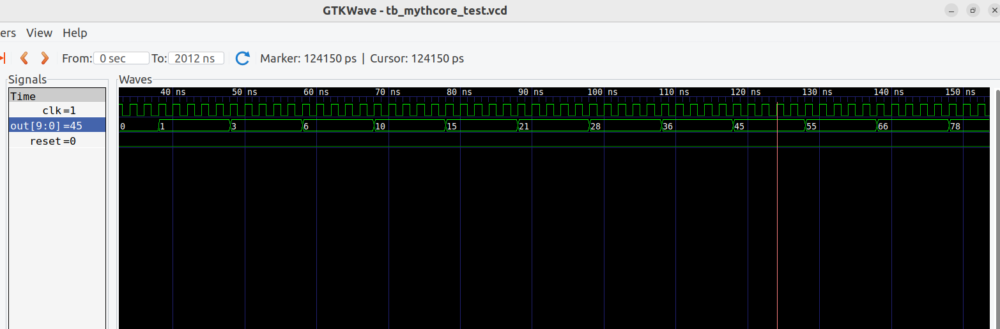

# VSDBabySoC — A Minimal RISC-V Based System-on-Chip

## Overview
**VSDBabySoC** is a **toy System-on-Chip (SoC)** design built for **learning and simulation** purposes.  
It integrates **three key IP cores (Intellectual Property modules)**:

- **rvmyth** → A small RISC-V processor  
- **avsdpll** → A Phase-Locked Loop (PLL) that generates a stable clock  
- **avsddac** → A Digital-to-Analog Converter (DAC)

The main goal is to **simulate and verify** how these modules interact using:
- **Icarus Verilog (iverilog)** → for simulation  
- **GTKWave** → for waveform visualization

---

## 🧩 Module Descriptions

### 1️⃣ vsdbabysoc.v — *Top-Level SoC*
Acts as the **glue logic** connecting all components.  
It wires the RISC-V CPU, PLL, and DAC together.

**Responsibilities:**
- Feeds PLL-generated clock to the CPU.  
- Connects CPU’s 10-bit output bus to the DAC.  
- Handles reset and reference voltage inputs.

**Internal Signals:**
- `RV_TO_DAC` → 10-bit bus (CPU → DAC)  
- `CLK` → Clock signal (PLL → CPU)

---

### 2️⃣ rvmyth.v — *RISC-V Core*
A compact **RISC-V processor core** that executes instructions.  
Outputs a **10-bit digital signal** based on its operations.

**Inputs:**  
- Clock (`CLK`)  
- Reset (`RESET`)

**Outputs:**  
- 10-bit digital data (`OUT[9:0]`)

---

### 3️⃣ avsdpll.v — *Phase-Locked Loop (PLL)*
Generates a **stable and clean clock** for the CPU.

**Inputs:**  
- Reference and control signals

**Outputs:**  
- Stable clock (`CLK_OUT`)

Without this, the CPU would not have a proper clock source to execute instructions reliably.

---

### 4️⃣ avsddac.v — *Digital-to-Analog Converter (DAC)*
Converts the CPU’s **10-bit digital output** into an **analog voltage**.

**Inputs:**  
- 10-bit digital bus (`D[9:0]`)  
- Reference voltage (`VREFH`)

**Outputs:**  
- Analog signal (`OUT`)

This represents how **digital computation** (CPU) connects with the **analog world** (voltage output).

---

## 🧪 Testbench — testbench.v

The testbench acts like your **virtual lab setup**, providing the necessary stimuli for simulation.

**Functions:**
- Generates clock and reset signals.  
- Instantiates the top-level SoC (`vsdbabysoc`).  
- Dumps all simulation signals into `.vcd` files for waveform analysis.

**Outputs:**
- `pre_synth_sim.vcd` → Waveform before synthesis  
- `post_synth_sim.vcd` → Waveform after synthesis  

You can visualize these using **GTKWave** to check signal transitions and interactions between the CPU, PLL, and DAC.

---

## Simulation the RISC-V Core:

ADD  x14, x0, x0    # sum = 0
ADDI x12, x0, 10    
ADD  x13, x0, x0    # counter = 0
Loop:
ADD  x14, x13, x14  # sum += counter
ADDI x13, x13, 1    # counter++
BLT  x13, x12, Loop 

The above program was executed in the RISC-V core.
The simulation results are:

We can see that the count is as expected.
Count : 1, 3, 6, 10, 15, 21, 28, 36, 45, 55, 66, ...