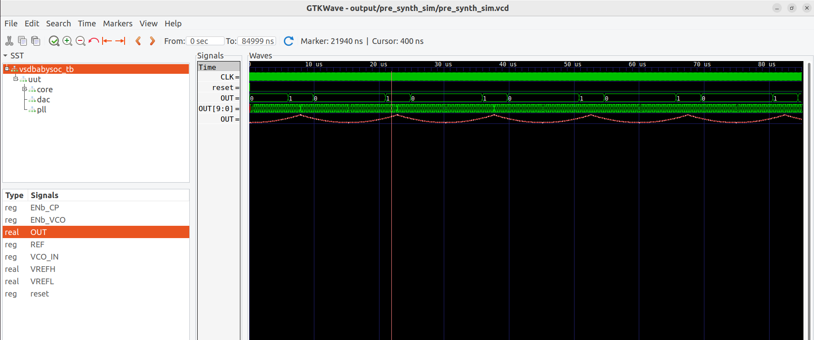
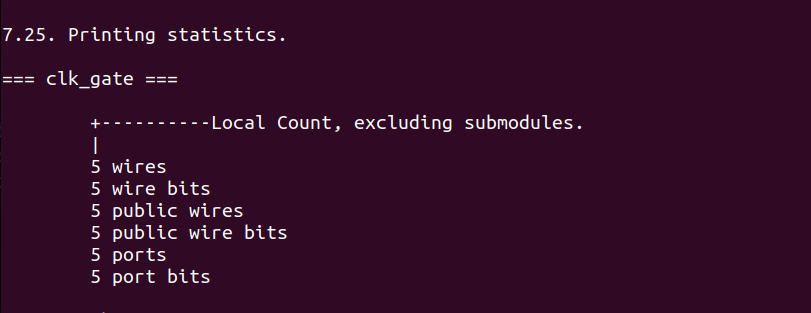
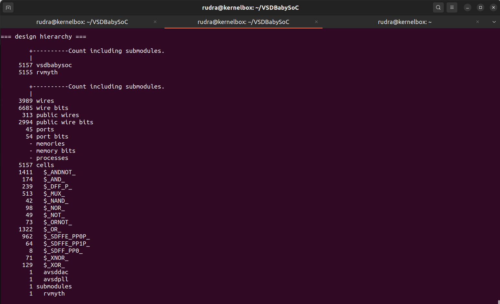
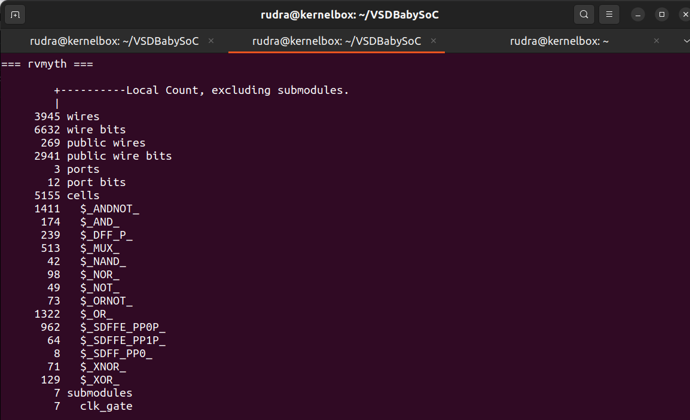
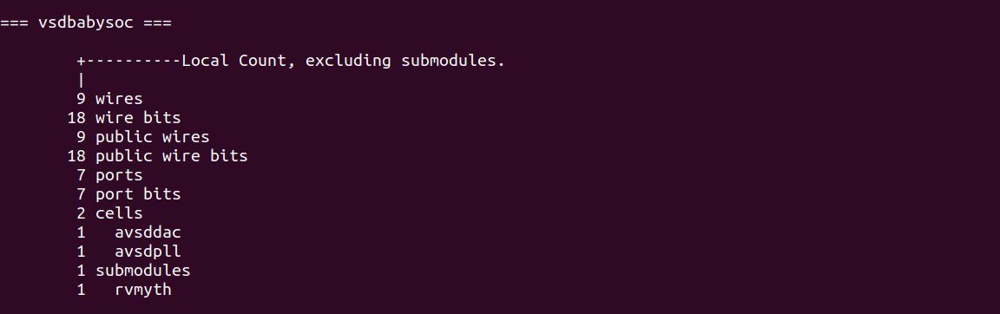
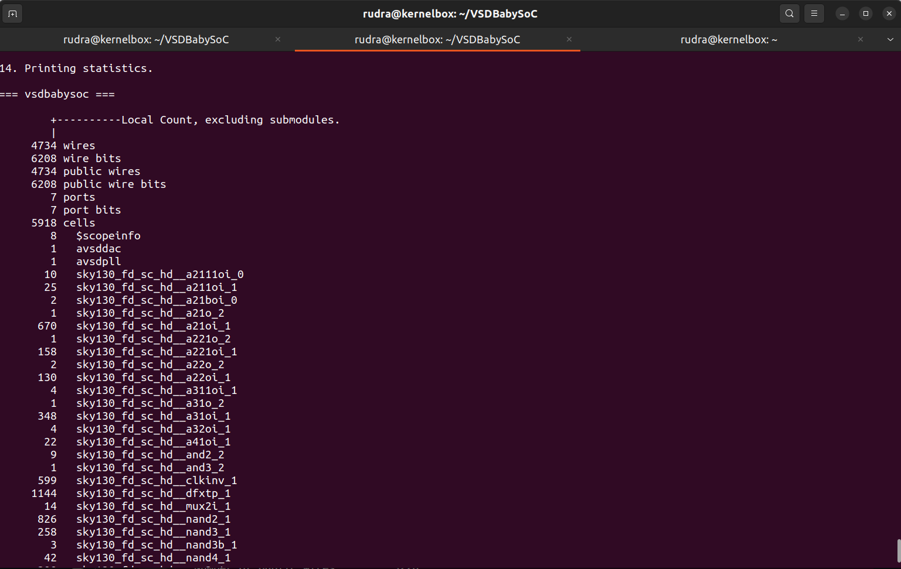
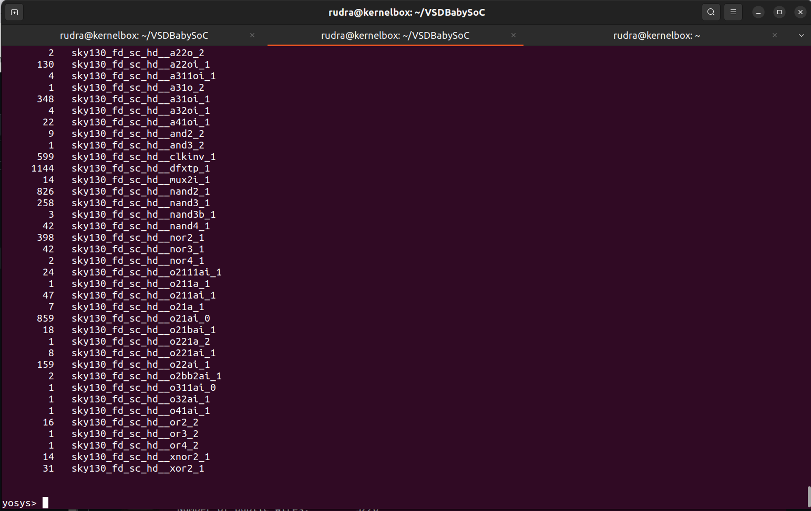
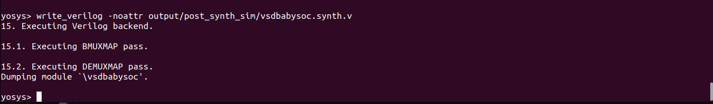
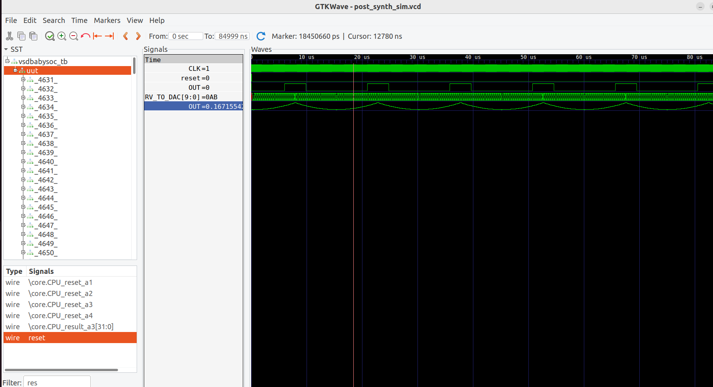

# Week 3 Task – Post-Synthesis GLS & STA Fundamentals

## Objective
The goal of this task is to:

1. Perform **Gate-Level Simulation (GLS)** after synthesizing the BabySoC design.
2. Validate that the GLS output matches the **functional simulation** output obtained in Week 2.
3. Get introduced to **Static Timing Analysis (STA)** concepts using **OpenSTA**.

---

## Overview

### Step 1: Functional Simulation (Pre-Synthesis- completed in week 2)
Initially, we simulate the **RTL design** of BabySoC to verify its functional correctness.  
This produces a **pre-synthesis waveform**, which serves as the reference for verifying post-synthesis behavior.




**Purpose:**
- Ensures that the RTL logic works correctly before synthesis.
- Detects functional errors early to avoid propagating them to the netlist.

---

### Step 2: Why Perform Gate-Level Simulation (GLS)?
After synthesis, the RTL is transformed into a **gate-level netlist** using technology-specific standard cells.  

**GLS validates:**
- That the synthesized netlist behaves identically to the original RTL.
- Any synthesis-related issues (mapping, optimization, or hierarchy flattening errors).

**GLS also allows:**
- Timing verification using **unit delays**.
- Preparation for **Static Timing Analysis (STA)**.

---

## Step 3: Synthesis Flow using Yosys

The BabySoC netlist is generated using **Yosys** with the following commands:

```bash
# Read RTL Verilog files
read_verilog src/module/vsdbabysoc.v
read_verilog -I src/include /home/rudra/VSDBabySoC/src/module/rvmyth.v
read_verilog -I src/include /home/rudra/VSDBabySoC/src/module/clk_gate.v


# Read standard cell libraries
read_liberty src/lib/sky130_fd_sc_hd__tt_025C_1v80.lib
read_liberty -lib src/lib/avsdpll.lib
read_liberty -lib src/lib/avsddac.lib

# Synthesize the top module
synth -top vsdbabysoc






# Map flip-flops to library cells
dfflibmap -liberty src/lib/sky130_fd_sc_hd__tt_025C_1v80.lib

# Optimize the netlist
opt
abc -liberty src/lib/sky130_fd_sc_hd__tt_025C_1v80.lib -script +strash;scorr;ifraig;retime;{D};strash;dch,-f;map,-M,1,{D}

# Flatten hierarchy and clean netlist
flatten
setundef -zero
clean -purge
rename -enumerate

# Generate synthesis statistics
stat




# Write synthesized netlist to output
write_verilog -noattr output/post_synth_sim/vsdbabysoc.synth.v



```

## GLS

```bash
iverilog -o /home/rudra/VSDBabySoC/output/post_synth_sim/post_synth_sim.out \
  -DPOST_SYNTH_SIM \
  -DFUNCTIONAL \
  -DUNIT_DELAY=#1 \
  -I /home/rudra/VSDBabySoC/src/module \
  -I /home/rudra/VSDBabySoC/src/gls_model \
  /home/rudra/VSDBabySoC/src/module/testbench.v

# Navigate to simulation output directory
cd /home/rudra/VSDBabySoC/output/post_synth_sim/

# Run the simulation
./post_synth_sim.out

# Open waveform in GTKWave
gtkwave post_synth_sim.vcd
```

### Notes:
- DPOST_SYNTH_SIM enables post-synthesis simulation.
- DFUNCTIONAL ensures functional correctness checking.
- DUNIT_DELAY=#1 introduces a unit delay for gate-level timing.




## Verification

- Compare the GLS waveform with the pre-synthesis waveform from Week 2(as mentioned in the start of this readme).

- All outputs match exactly, verifying that synthesis did not alter functionality.