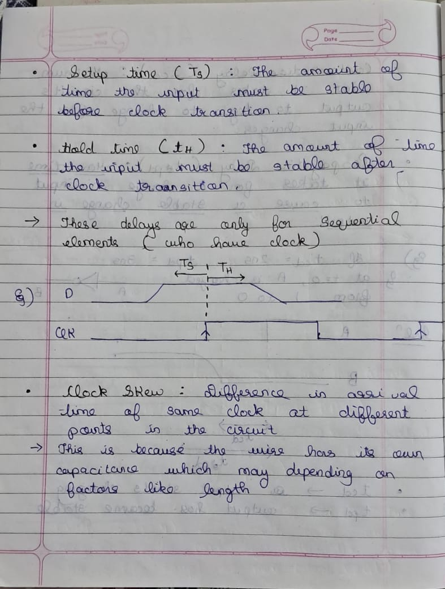
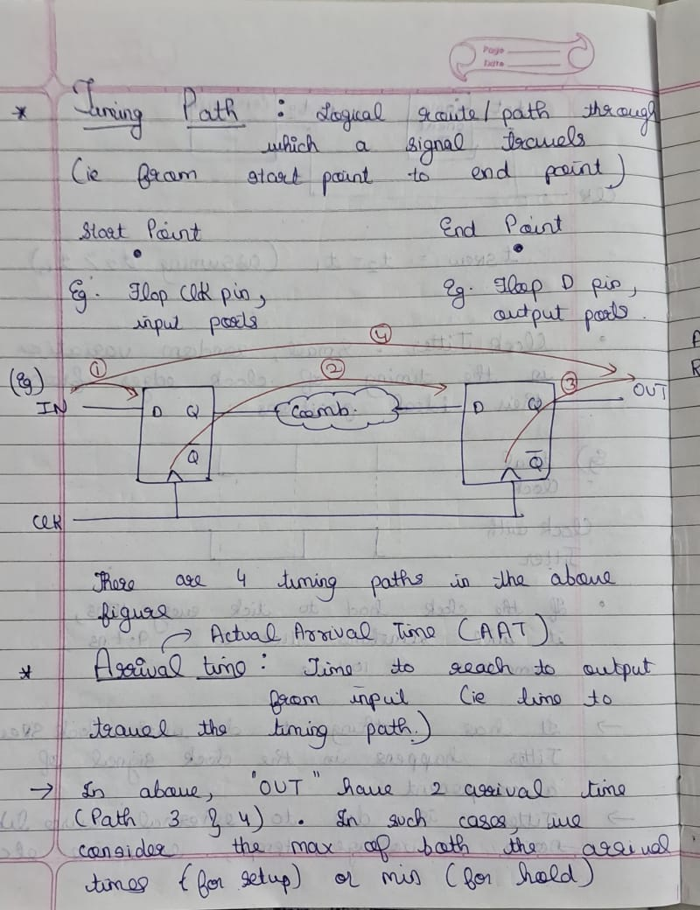
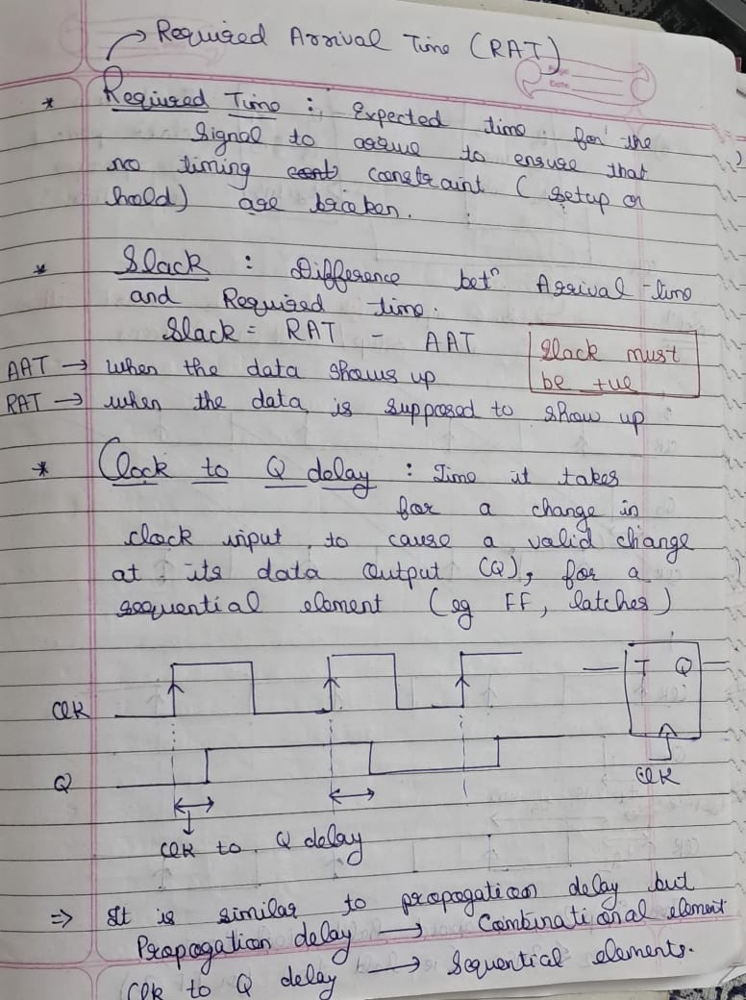

# Week 3 Task – Fundamentals of STA (Static Timing Analysis)

## Objective
The goal of this task is to understand the basics of **Static Timing Analysis (STA)** and its practical concepts, including:

1. Setup and hold checks  
2. Slack calculation  
3. Clock definitions  
4. Path-based timing analysis  
5. Other advanced STA concepts like RAT, RRT, and GBA/PBA  
6. On-chip variations and their impact on timing  

STA allows verification of timing in a digital design **without the need for simulation**, ensuring that all signals meet timing requirements across different paths and clock domains.

---

**Focus Topics for This Task:**
- Setup and Hold Checks  
- Slack  
- Clock Definitions  
- Path-Based Analysis  
- RAT, RRT, GBA-PBA  
- On-Chip Variations  

---

## Key STA Concepts

### 1️⃣ Setup and Hold Checks
- **Setup time:** Minimum time before the clock edge that data must be stable at the flip-flop input.  
- **Hold time:** Minimum time after the clock edge that data must remain stable at the flip-flop input.  
- Violating setup or hold time can cause **timing errors** or metastability.

---

### 2️⃣ Slack
- **Slack** = Required Arrival Time − Actual Arrival Time  
- **Positive slack:** Timing is met.  
- **Negative slack:** Timing violation; path is timing-critical.

---

### 3️⃣ Clock Definitions
- Define clock frequency, period, and waveform shape.  
- STA uses the clock definition to check all timing paths between flip-flops.  
- Accurate clock definitions are essential for correct slack calculations.

---

### 4️⃣ Path-Based Analysis
- STA analyzes **all paths** between source and destination flip-flops.  
- Identifies **critical paths** where timing violations are most likely.  
- Can be performed using **GBA (Graph-Based Analysis)** or **PBA (Path-Based Analysis)**.  
  - **GBA:** Faster, uses graph abstraction of the design.  
  - **PBA:** More accurate, evaluates actual paths in detail.

---

### 5️⃣ RAT (Required Arrival Time) and RRT (Required Ready Time)
- **RAT:** Latest time a signal can arrive at a node to meet setup constraints.  
- **RRT:** Earliest time a signal must arrive to meet hold constraints.  
- STA calculates RAT/RRT to detect setup and hold violations.

---

### 6️⃣ On-Chip Variations
- Manufacturing variations can affect timing:  
  - **Etching variations**  
  - **Oxide thickness variations**  
  - **Threshold voltage variations**  
- These affect **resistance, drain current, and delay**, leading to path-dependent timing differences.  

## References
- STA Fundamentals – Udemy: [https://www.udemy.com/course/vlsi-academy-sta-checks/?couponCode=F960AEDD365E0CD12546](https://www.udemy.com/course/vlsi-academy-sta-checks/?couponCode=F960AEDD365E0CD12546)

