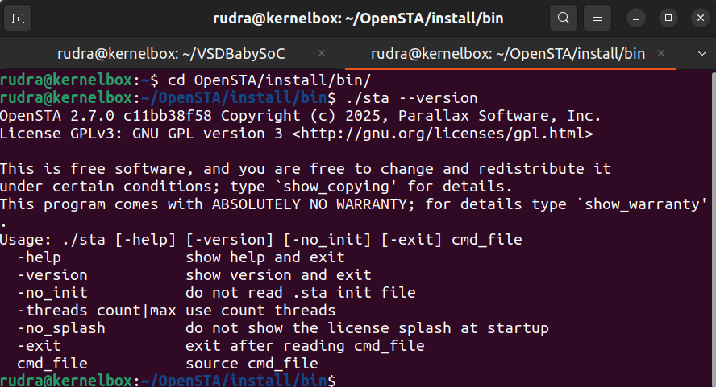
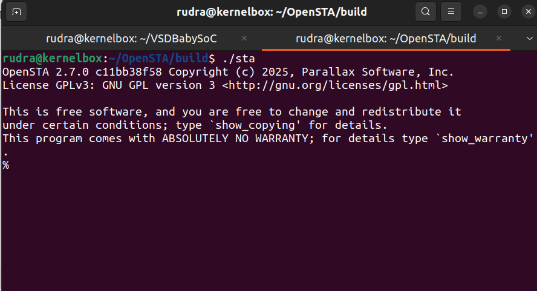
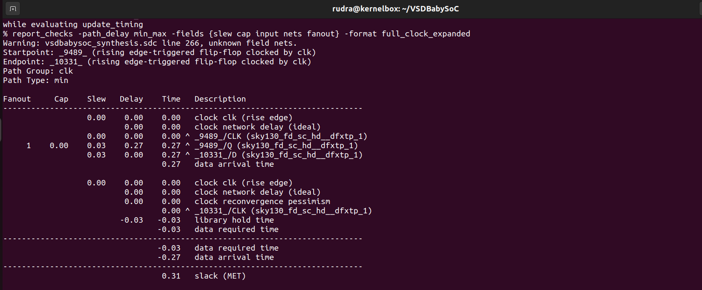
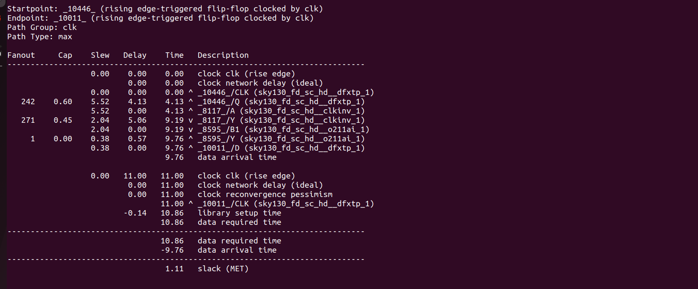

# Week 3 Task – Static Timing Analysis (STA) Using OpenSTA

## Objective
The goal of this task is to perform **Static Timing Analysis (STA)** on the synthesized BabySoC design using OpenSTA, generate timing reports, identify critical paths, and produce timing graphs for analysis.

---


## Installation

### System Requirements
| Component | Version (Recommended) |
|------------|-----------------------|
| Ubuntu     | 22.04.2 LTS           |
| GCC        | 11.4.0                |
| CMake      | 3.24.2 or newer       |
| TCL        | 8.6                   |
| SWIG       | 4.1.0                 |
| Bison      | 3.8.2                 |
| Flex       | 2.6.4                 |
| Eigen3     | 3.4.0                 |
| zlib       | 1.2.5+ (optional)     |

---

## ⚙️ Install Dependencies

Run the following commands:

```bash
sudo apt update
sudo apt install -y \
  build-essential cmake git tcl-dev swig \
  bison flex zlib1g-dev libeigen3-dev

```
For CUDD;
```bash
cd ~
wget ftp://vlsi.colorado.edu/pub/cudd-3.0.0.tar.gz
tar -xvzf cudd-3.0.0.tar.gz
cd cudd-3.0.0
./configure --prefix=$HOME/cudd-3.0.0/build/install
make -j$(nproc)
make install
```

Build and Install OpenSTA
```bash
# Clone the OpenSTA repository
git clone https://github.com/parallaxsw/OpenSTA.git
cd OpenSTA

# Create and enter build directory
mkdir build && cd build

# Configure the build
cmake \
  -DCMAKE_BUILD_TYPE=RELEASE \
  -DCUDD_DIR=~/cudd-3.0.0/build/install \
  -DTCL_LIBRARY=/usr/lib/libtcl8.6.so \
  -DTCL_HEADER=/usr/include/tcl8.6 \
  -DZLIB_ROOT=/usr/lib \
  -DCMAKE_INSTALL_PREFIX=~/OpenSTA/install ..

# Build and install
make -j$(nproc)
make install
```
Verify Installtion
```bash
cd ~/OpenSTA/install/bin
./sta --version
```



To run/open OpenSTA
```bash
cd OpenSTA/build
./sta
```



## Prerequisites
- Synthesized netlist (`vsdbabysoc.synth.v`) from post-synthesis flow
- Standard cell liberty files:
  - `sky130_fd_sc_hd__tt_025C_1v80.lib`
  - `avsdpll.lib`
  - `avsddac.lib`
- Design constraints file (SDC): `vsdbabysoc_synthesis.sdc`
- OpenSTA installed and built

---

## Perfromig STA:


```bash
./sta

# Read liberty library
read_liberty -library src/lib/sky130_fd_sc_hd__tt_025C_1v80.lib

# Read netlist
read_verilog output/post_synth_sim/vsdbabysoc.synth.v

# Link design
link_design vsdbabysoc

# Read SDC constraints
read_sdc vsdbabysoc.sdc

# Run STA
report_checks -path_delay min_max -fields {slew cap input nets fanout} -format full_clock_expanded
report_checks -path_delay min_max -fields {slew cap input nets fanout} -format full_clock_expanded > output/sta/timing_report.txt

# Report timing summary
report_timing_summary

# Optional: Generate graph (requires graphviz)
# write_graph -format dot -output output/sta/timing_graph.dot# Read liberty library
read_liberty -library src/lib/sky130_fd_sc_hd__tt_025C_1v80.lib

# Read netlist
read_verilog output/post_synth_sim/vsdbabysoc.synth.v

# Link design
link_design vsdbabysoc

# Read SDC constraints
read_sdc vsdbabysoc.sdc

# Run STA
report_checks -path_delay min_max -fields {slew cap input nets fanout} -format full_clock_expanded

```




