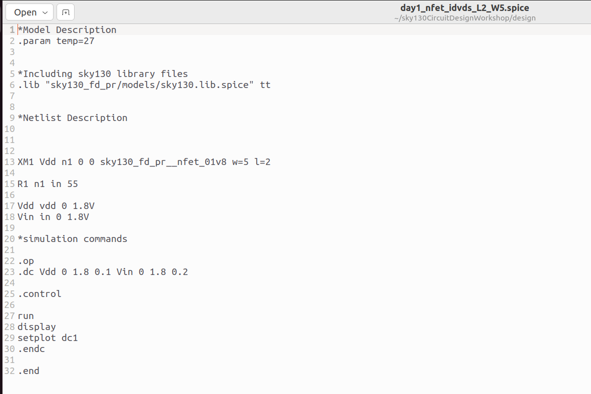
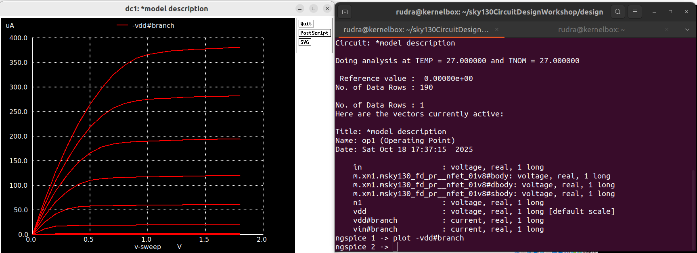
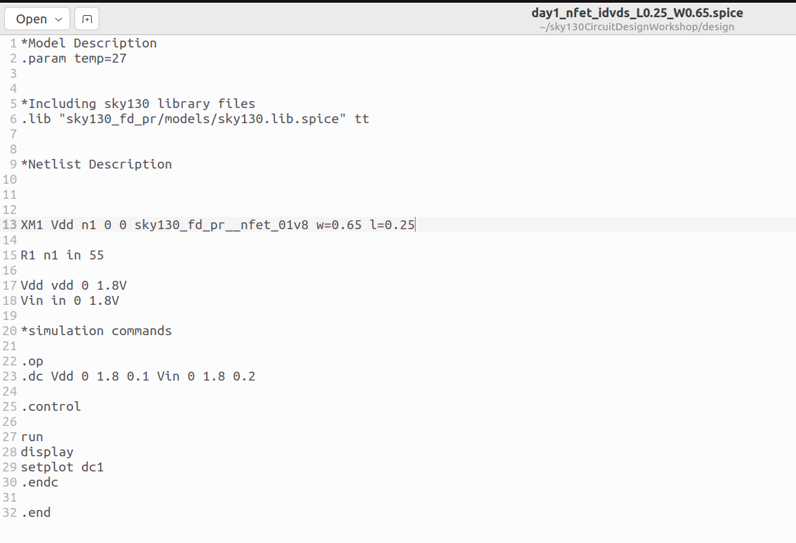
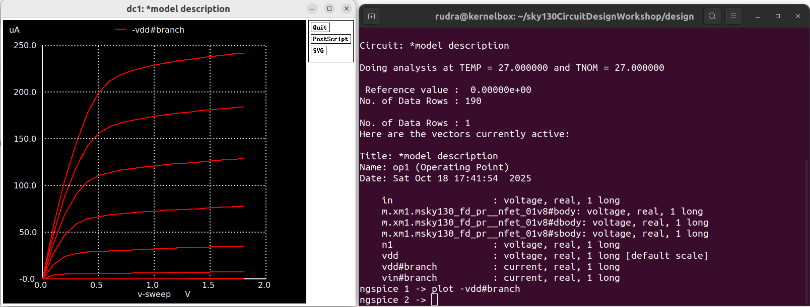

# 🧠 Introduction to SPICE Simulation

## 📘 Overview

**SPICE (Simulation Program with Integrated Circuit Emphasis)** is an analog circuit simulator used to analyze and verify electronic circuits before fabrication.  
It allows engineers to study transistor characteristics, voltage/current behavior, and circuit performance efficiently — **without building the physical hardware**.

This project demonstrates **DC characterization of an NMOS transistor** using the **SkyWater SKY130 PDK** in **NGSpice**.  
We analyze how the transistor’s drain current (`Id`) varies with drain-to-source voltage (`Vds`) for different gate voltages (`Vgs`), and how changing **channel dimensions (W/L)** affects the output characteristics.

---

## Installation Steps

Run the following commands in your terminal:

```bash
sudo apt update
sudo apt install ngspice
```
Verify the installation:
```bash
ngspice -v
```

## Simulation and Resuls

### Case 1: NMOS with W = 5 µm, L = 2 µm

File: day1_nfet_idvds_L2_W5.spice
Model Used: sky130_fd_pr__nfet_01v8

### Netlist Description




```bash
XM1 Vdd n1 0 0 sky130_fd_pr__nfet_01v8 w=5 l=2
R1 n1 in 55
Vdd vdd 0 1.8V
Vin in 0 1.8V

.op
.dc Vdd 0 1.8 0.1 Vin 0 1.8 0.2
```

### Simulation Result




- The drain current (Id) rises as gate voltage (Vgs) increases.
- At high Vds, the curves flatten — representing the saturation region.
- A larger W/L ratio (5/2 = 2.5) gives higher drive current.


### Case 2: NMOS with W = 0.65 µm, L = 0.25 µm

File: day1_nfet_idvds_L0.25_W0.65.spice
Model Used: sky130_fd_pr__nfet_01v8

### Netlist Description

```bash
XM1 Vdd n1 0 0 sky130_fd_pr__nfet_01v8 w=0.65 l=0.25
R1 n1 in 55
Vdd vdd 0 1.8V
Vin in 0 1.8V

.op
.dc Vdd 0 1.8 0.1 Vin 0 1.8 0.2

```

Simulation Result


- The overall current is smaller due to the reduced transistor area.
- The MOSFET reaches saturation earlier because of shorter channel length.
- This demonstrates how scaling impacts current drive and saturation behavior.