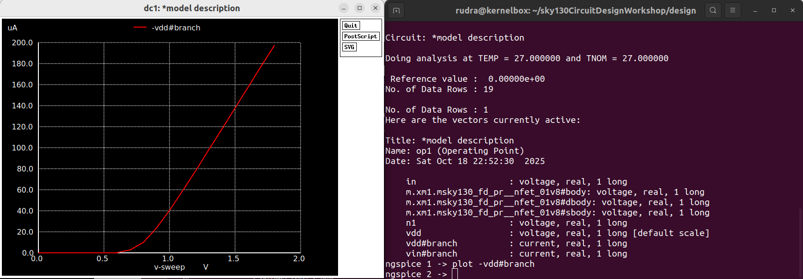
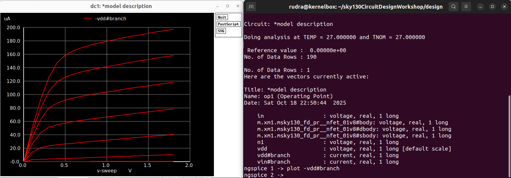

# Velocity Saturation Effects in MOSFETs

## Introduction

As MOSFET channel lengths are scaled down into the **deep submicron regime**, the electric field inside the channel increases significantly.  
When this field becomes very strong, carriers (electrons in NMOS) can no longer increase their drift velocity linearly with the electric field — instead, their velocity **saturates** at a maximum value called the **saturation velocity (v_sat)**.

This phenomenon is known as **Velocity Saturation**.

---

## Physical Concept

In long-channel devices:
- The carrier velocity (`v`) is proportional to the electric field (`E`):  
  \[
  v = \mu E
  \]
  where `μ` is the carrier mobility.

In short-channel devices:
- When `E` exceeds a critical field `E_c`, the velocity saturates:
  \[
  v = v_{sat}
  \]

This means that even if the drain voltage increases, the carrier velocity (and hence the current) doesn’t increase proportionally — leading to **current saturation at lower Vds** values.

---

## Simulation Setup

## Simulation 1 — Id vs Vgs (Transfer Characteristics)

**File:** `idvsVgs.spice`

- Drain voltage (`Vds`) = constant  
- Gate voltage (`Vgs`) = swept from 0 V to 2 V  
- Measured: Drain current (`Id`)

**Plot:**

### Observation:

- At low `Vgs`, the transistor is **OFF** (cutoff region).  
- After threshold (`Vth` ≈ 0.6 V), current rises rapidly — MOSFET enters **saturation region**.  
- The curve becomes slightly **sublinear** at high `Vgs`, indicating **velocity saturation**.  
  The drain current no longer increases quadratically with gate voltage as in long-channel devices.

### Theoretical Background:

For **long-channel MOSFETs**,  
\[
I_D = \frac{1}{2} \mu C_{ox} \frac{W}{L} (V_{GS}-V_{TH})^2
\]

For **short-channel MOSFETs** (with velocity saturation),  
\[
I_D = C_{ox} W v_{sat} (V_{GS} - V_{TH})
\]

Hence, the dependence changes from **quadratic** to **linear** with `Vgs`.

---

## 🧩 Simulation 2 — Id vs Vds (Output Characteristics)

**File:** `idvsVds.spice`

- Gate voltage (`Vgs`) varied from 0 V to 1.8 V in steps.  
- Drain voltage (`Vds`) swept from 0 V to 2 V.  
- Measured: Drain current (`Id`).

**Plot:**

### 🧾 Observation:

- For small `Vds`, the MOSFET operates in the **linear region**, and `Id` increases nearly linearly.  
- As `Vds` increases, the curve **saturates earlier** than in long-channel devices due to **velocity saturation**.  
- The slope of the saturation region becomes gentler, showing the **limiting effect of v_sat** on current growth.  
- At high `Vgs`, saturation occurs at lower `Vds`, confirming **velocity saturation dominance**.

---

## ⚖️ Comparison: Long vs Short Channel Behavior

| Feature | Long Channel MOSFET | Short Channel MOSFET (Velocity Saturation) |
|----------|--------------------|---------------------------------------------|
| Carrier Velocity | Increases linearly with `E` | Saturates at `v_sat` |
| Id–Vgs Relation | Quadratic | Linear |
| Id–Vds Curve | Saturation at higher `Vds` | Saturation at lower `Vds` |
| Transconductance | Higher (∝ (Vgs - Vth)) | Reduced (constant beyond certain Vgs) |
| Region Transition | Clear linear → saturation | Gradual transition due to v_sat |

---

## Practical Implications

- Velocity saturation **limits the maximum current** achievable, even for large gate voltages.  
- It leads to **reduced transconductance (gm)** and **lower intrinsic gain (gm/Id)**.  
- However, it also improves **switching speed** because of reduced channel transit time.  
- This effect becomes dominant in **deep submicron CMOS technologies (≤180 nm)**.

---

## Conclusion

From the above simulations:
- The **Id–Vgs** curve flattens at higher gate voltages.  
- The **Id–Vds** curve saturates earlier and more gradually.  
- These are clear indicators of **velocity saturation**, a key short-channel effect.  

Understanding and modeling this effect accurately is essential for:
- Designing **high-speed digital circuits**.  
- Predicting **analog performance** in scaled technologies.  
- Ensuring reliable operation in **modern VLSI design**.

---

