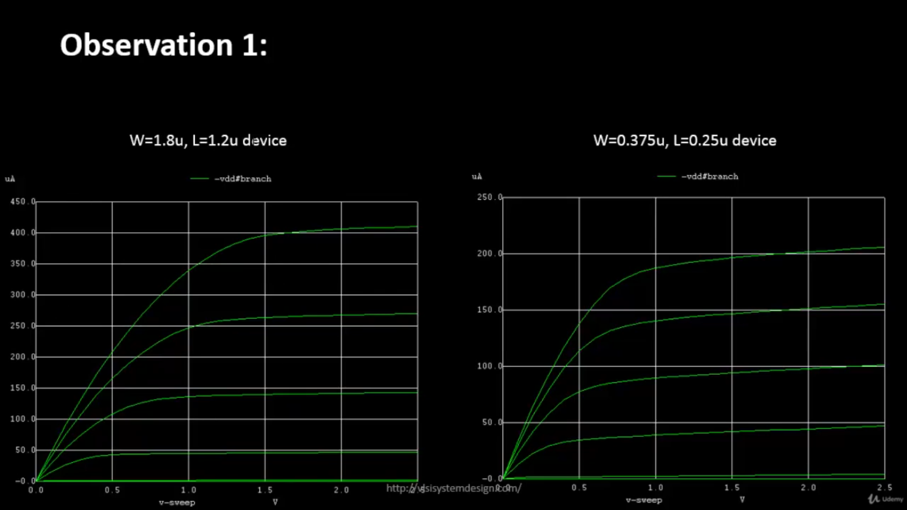

# Velocity Saturation Effect

## 1. The effect

In MOSFET devices, as technology scales down into the nanometer regime, the **electric field** across the channel increases significantly for a given drain-to-source voltage (VDS). This strong electric field causes the **carrier drift velocity** to no longer increase linearly with field, leading to what is known as the **velocity saturation effect**.

---

## 2. Long Channel vs Short Channel Devices

| Parameter | Long Channel Device (> 250 nm) | Short Channel Device (< 250 nm) |
|------------|--------------------------------|----------------------------------|
| **Dominant Mechanism** | Channel pinch-off controls saturation | Velocity saturation dominates |
| **Carrier Velocity (v)** | v = μE (linear increase with field) | v → vsat (saturates at high field) |
| **Drain Current (ID) Dependence** | ID ∝ (VGS − VTH)² | ID ∝ (VGS − VTH) |
| **Saturation Mechanism** | Channel pinch-off near drain | Velocity saturation near drain |
| **Impact** | Higher transconductance (gm), quadratic I–V | Reduced gm, linear I–V |
| **Short Channel Effects** | Negligible | Significant (DIBL, VTH roll-off, etc.) |

---

## 3. Operation Regions

**Figure 1:** Operation modes of long and short channel devices  

- Thus, short channel devices have 4 modes while long channel devices have the 3 traditonal modes.

When **(VGS − VT) = VGT**, the drain current can be expressed as:

\[
I_D = k_n \cdot \left[ (V_{GT} \cdot V_{min}) - \frac{V_{min}^2}{2} \right] \cdot (1 + \lambda V_{DS})
\]
where  
\[
V_{min} = \min(V_{GT}, V_{DS}, V_{DS,sat})
\]

---

## 4. Effect on I–V Characteristics

### (a) ID–VGS Characteristics

**Figure 2:** ID vs VGS for long and short channel devices  

In **Figure 2**, we observe the drain current (ID) versus gate voltage (VGS) for:

- **Left:** Long channel device (W = 1.8 µm, L = 1.2 µm)  
- **Right:** Short channel device (W = 0.375 µm, L = 0.25 µm)

Even though both devices have the **same W/L ratio**, the short-channel device exhibits **lower ID** because of **carrier velocity saturation**.

**Observation:**  
- In the long channel, ID increases quadratically with VGS.  
- In the short channel, the increase is **linear**, showing velocity-limited current flow.

---

### (b) ID–VDS Characteristics

**Figure 3:** ID vs VDS characteristics showing early saturation in short-channel devices  

In **Figure 3**, the ID–VDS characteristics highlight the difference in how **current saturates**:

- **Long Channel (Left):**  
  Current saturation occurs due to **pinch-off**, and the maximum current is higher.

- **Short Channel (Right):**  
  The current saturates **earlier** and **at a lower value**, due to the **limitation of carrier velocity** at high fields (vsat).

---

## 5. Key Takeaways

1. **Velocity saturation** limits the drift velocity of carriers at high electric fields.
2. **Short-channel devices** operate under much higher electric fields, thus experiencing velocity saturation earlier.
3. **(IMP)** Even for **identical W/L ratios**, the **peak ID** in short-channel devices is **smaller** because velocity (and hence current) cannot increase linearly with field.
4. **(IMP)** The **I–V curve changes shape** — from quadratic to linear — as we move from long-channel to short-channel regimes.

# CMOS Inverter: Static and Dynamic Behavior Analysis

## 1. Introduction

A **CMOS inverter** is the fundamental building block of all digital integrated circuits.  
It consists of a **p-channel MOSFET (PMOS)** and an **n-channel MOSFET (NMOS)** connected in a complementary fashion.

When the input (Vin) is **low**, the PMOS conducts and NMOS is OFF, producing a **logic high** at the output (Vout).  
When the input is **high**, the NMOS conducts and PMOS is OFF, producing a **logic low** at the output.

This complementary action ensures **low static power dissipation**, since ideally, only one transistor conducts at a time.

---

## 2. CMOS Inverter Circuit

**Figure 1** shows the schematic representation of a CMOS inverter. The input voltage (Vin) is applied to both gates, while the output (Vout) is taken at the common drain node. The load capacitance **CL** represents parasitic and interconnect capacitance.

**Figure 1:** CMOS Inverter Schematic  

---

## 3. Voltage Transfer Characteristics (VTC)

The **Voltage Transfer Characteristic (VTC)** shows the relationship between **Vout** and **Vin**. It defines the static behavior of the inverter.

- For **Vin = 0 V**, PMOS is **ON**, NMOS is **OFF**, and **Vout = VDD**.  
- For **Vin = VDD**, PMOS is **OFF**, NMOS is **ON**, and **Vout = 0 V**.  
- Between these two extremes, both transistors conduct partially — the transition region where switching occurs.

**Figure 2:** DC Voltage Transfer Characteristic of CMOS Inverter  

The **VTC curve** is crucial for determining:
- **Switching Threshold (Vm)** — the point where Vin = Vout.  
- **Noise Margins** — which quantify the inverter’s immunity to noise.

---

## 4. Transient Response

The **transient simulation** shows the dynamic behavior of the inverter when Vin is switched between logic levels.

- When **Vin rises**, NMOS turns ON and pulls the output to **0 V** (fall transition).  
- When **Vin falls**, PMOS turns ON and pulls the output to **VDD** (rise transition).  
- The load capacitance (CL) causes finite rise and fall times, determining propagation delay.

**Figure 3:** Transient Response of CMOS Inverter  

The inverter behaves as a **time-dependent switch**, charging and discharging CL through the transistor resistances.

---

## 5. Switching Threshold (Vm)

The **switching threshold (Vm)** is the input voltage at which:
\[
V_{in} = V_{out}
\]
At this point, **both PMOS and NMOS are partially ON**, and the currents through them are equal:
\[
I_{Dn} = I_{Dp}
\]

**Figure 4:** Switching Threshold Analysis (Vin = Vout)  

A well-balanced inverter has **Vm ≈ VDD/2**, ensuring symmetric noise margins and balanced rise/fall times.

---

## 5. Switching Threshold (Vm)

The **switching threshold (Vm)** is the input voltage at which:
\[
V_{in} = V_{out}
\]
At this point, **both PMOS and NMOS are partially ON**, and the currents through them are equal:
\[
I_{Dn} = I_{Dp}
\]

**Figure 4:** Switching Threshold Analysis (Vin = Vout)  

A well-balanced inverter has **Vm ≈ VDD/2**, ensuring symmetric noise margins and balanced rise/fall times.

---

## 6. Effect of Transistor Sizing on Vm

The **ratio of PMOS to NMOS widths (Wp/Wn)** determines the **switching threshold** of the inverter.

- **Increasing Wp/Lp** → stronger PMOS → shifts **Vm upward**  
- **Increasing Wn/Ln** → stronger NMOS → shifts **Vm downward**

**Key Objective:**  
Achieve **Vm ≈ VDD/2** for a balanced inverter by properly sizing PMOS and NMOS.

**Figure 5:** Effect of PMOS/NMOS Width on Switching Threshold  

From the table:
- Increasing PMOS width (Wp) **raises** the switching threshold Vm.
- Rise time decreases (stronger PMOS charging), while fall time increases slightly.
- The **optimal Wp/Wn ratio** is typically **2–3**, ensuring Vm ≈ VDD/2.

---

## 7. Summary

| Parameter | Description |
|------------|--------------|
| **VTC** | Defines the static input-output behavior of the inverter |
| **Switching Threshold (Vm)** | Point where Vin = Vout and both transistors conduct |
| **Transistor Sizing** | Adjusts Vm and balances rise/fall delays |
| **Rise Time (tr)** | Controlled by PMOS strength |
| **Fall Time (tf)** | Controlled by NMOS strength |
| **Goal** | Balanced inverter with Vm ≈ VDD/2 and equal rise/fall times |

---