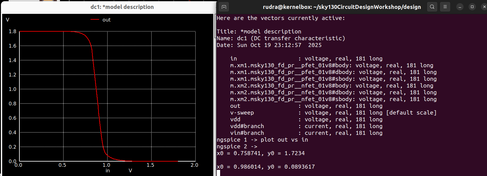
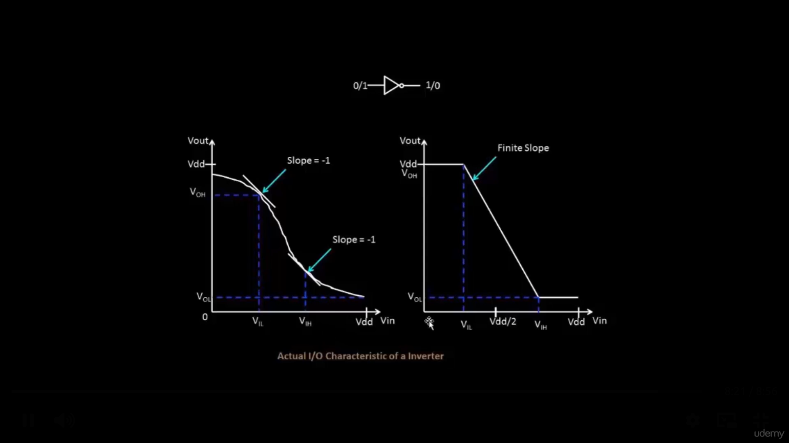
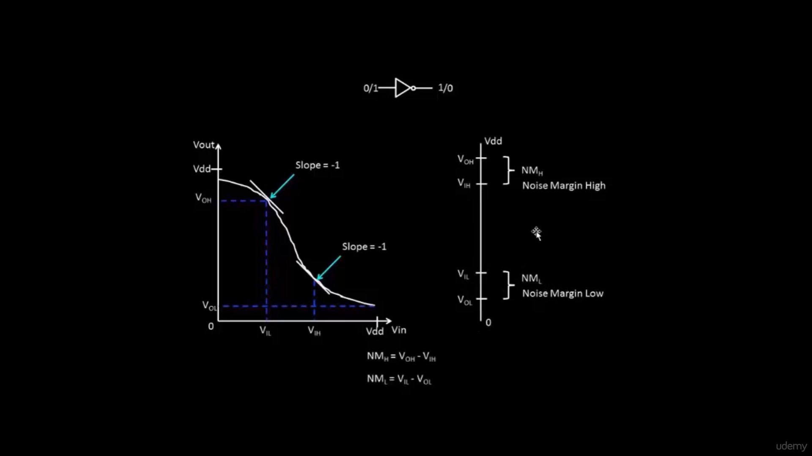
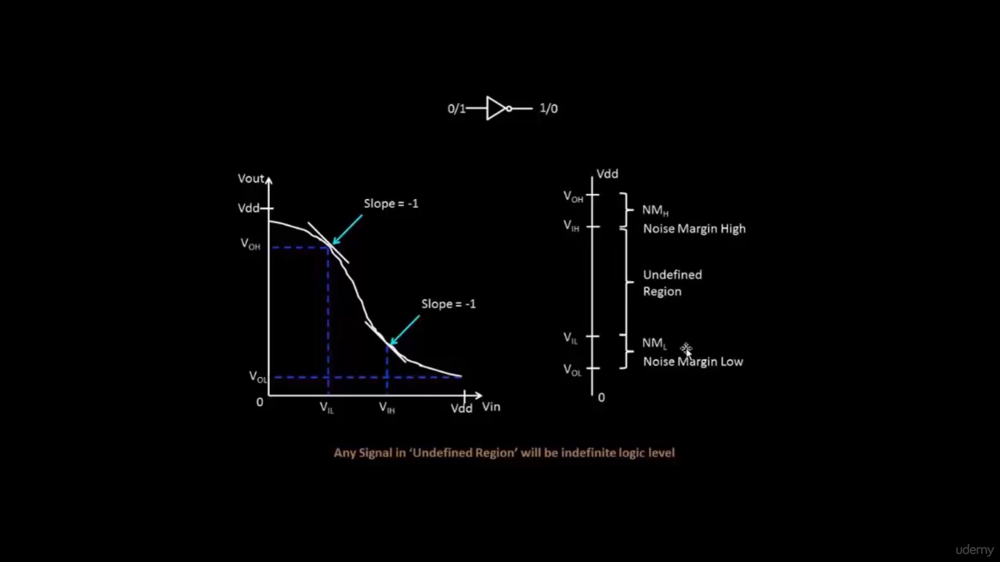

# Noise Margin in CMOS Inverters

## Introduction

In digital CMOS logic circuits, **Noise Margin** is a critical parameter that defines the inverter’s ability to tolerate noise or voltage disturbances without causing logic errors.  
It ensures that a logic **‘1’** or **‘0’** is interpreted correctly even in the presence of small unwanted variations.

A CMOS inverter is the simplest and most fundamental logic gate, composed of one **PMOS** and one **NMOS** transistor. The analysis of its **Voltage Transfer Characteristics (VTC)** helps us understand its **Noise Margins** and overall robustness.

---

## CMOS Inverter Transfer Characteristics

The **Voltage Transfer Characteristic (VTC)** shows how the output voltage (*Vout*) changes with respect to the input voltage (*Vin*).  
It consists of three regions:

1. **Region I (Vin < VIL)**  
   - NMOS → OFF, PMOS → ON  
   - Output is at logic HIGH (≈ VDD)  
   - Represents the region where inverter output = VOH

2. **Region II (VIL < Vin < VIH)**  
   - Both transistors conduct partially  
   - Rapid transition from HIGH to LOW output  
   - The slope of the curve ≈ -1 near the switching point (**Vm**)

3. **Region III (Vin > VIH)**  
   - NMOS → ON, PMOS → OFF  
   - Output drops to logic LOW (≈ 0V)  
   - Represents the region where inverter output = VOL

---

## Simulation Result

The DC transfer characteristics of a CMOS inverter were simulated using **ngspice** and the **Sky130 PDK**.

**Observation from the plot:**
- **VDD = 1.8V**
- **Switching Threshold (Vm)** ≈ 0.98V  
- The transition region is sharp, and the slope ≈ -1, confirming ideal inverter behavior.  
- The output remains near 1.8V (logic HIGH) for low inputs and near 0V (logic LOW) for high inputs.

---

## Understanding Noise Margins

To ensure reliable digital operation, we define four voltage levels:

- **VOH** → Minimum output voltage recognized as logic HIGH  
- **VOL** → Maximum output voltage recognized as logic LOW  
- **VIH** → Minimum input voltage recognized as logic HIGH  
- **VIL** → Maximum input voltage recognized as logic LOW  

The **Noise Margins** are calculated as:

\[
NM_H = VOH - VIH
\]

\[
NM_L = VIL - VOL
\]

These represent the tolerance to noise in HIGH and LOW states respectively.

---

## Graphical Explanation

The following diagrams illustrate how **Noise Margins** are derived from the inverter’s transfer curve:

### Key Points:
- The **undefined region** between *VIL* and *VIH* represents voltages where logic levels cannot be reliably determined.  
- Any signal falling in this range may lead to unpredictable output behavior.  
- A steep transition (slope ≈ -1) minimizes this undefined region, improving logic reliability.

---

## ⚖️ Effect of Transistor Width Ratios (Wp/Wn)

The **switching threshold voltage (Vm)** of a CMOS inverter depends on the **width-to-length ratio (W/L)** of the PMOS and NMOS transistors.

- When **Wp/Wn = 1**, inverter threshold ≈ **VDD/2** (balanced case).  
- Increasing **Wp/Wn** (wider PMOS) shifts **Vm upward**, since PMOS becomes stronger.  
- Decreasing **Wp/Wn** shifts **Vm downward**, making NMOS dominant.

As a result, adjusting the transistor width ratio helps in tuning:
- The **Switching Threshold (Vm)**  
- The **Noise Margins (NMH and NML)**  
- The **Symmetry of the VTC Curve**

---

## Experimental Observation

The relationship between transistor sizing and noise margin is illustrated below:

From this reference (VLSI System Design, Udemy):
- As **Wp/Wn** increases, the **switching threshold Vm** shifts higher.  
- **NMH** slightly increases, while **NML** slightly decreases.  
- A balanced inverter typically uses **Wp/Wn ≈ 2–3** to achieve symmetric and robust noise margins.

---

## Summary

- **Noise Margin** ensures reliable logic-level interpretation despite voltage noise.  
- **NMH** and **NML** quantify the inverter’s immunity to noise for HIGH and LOW levels respectively.  
- The **VTC** defines regions of stable logic operation and transition.  
- **Width ratio (Wp/Wn)** directly influences switching threshold and noise immunity.  
- A steeper inverter characteristic (slope ≈ -1) leads to better noise tolerance and sharper switching.

---

