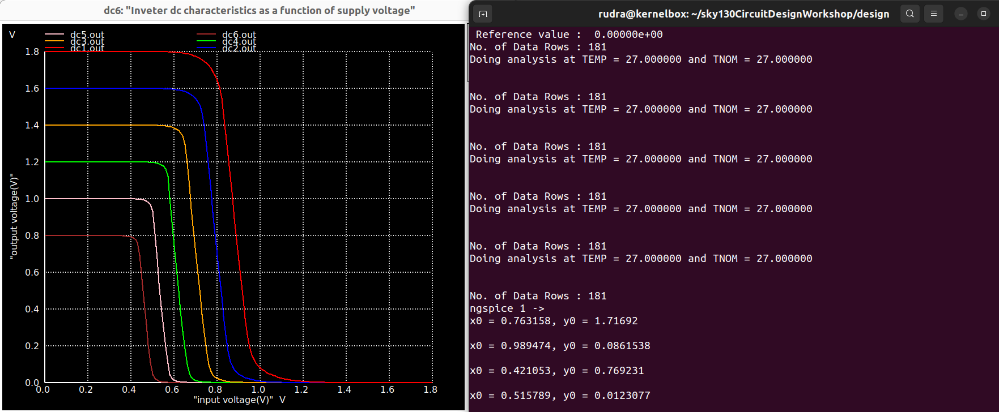
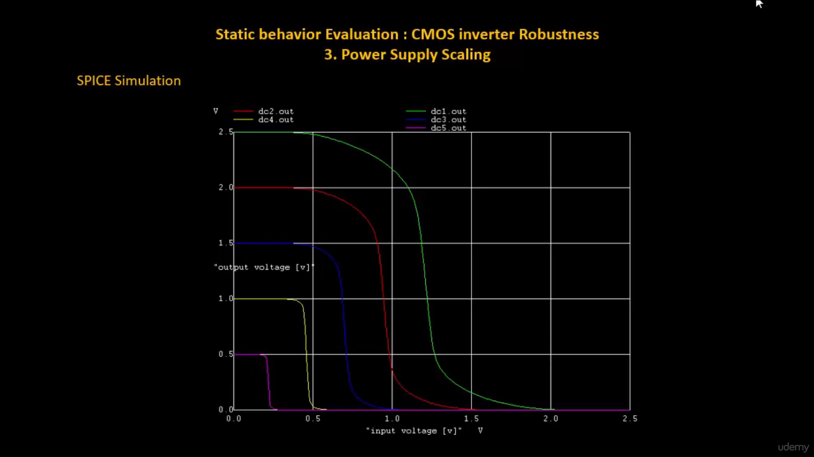
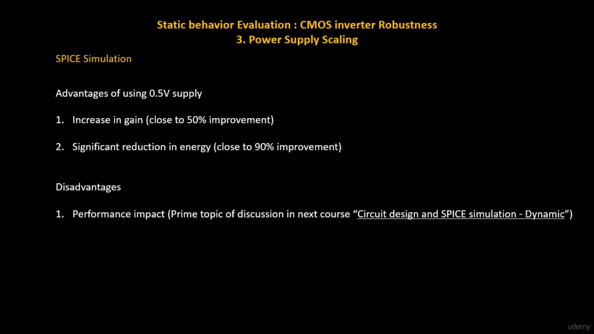
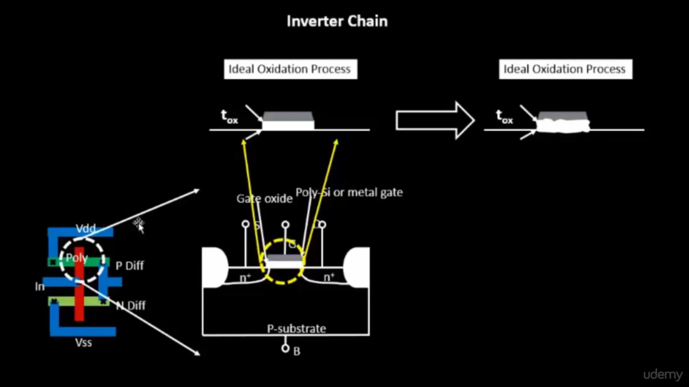
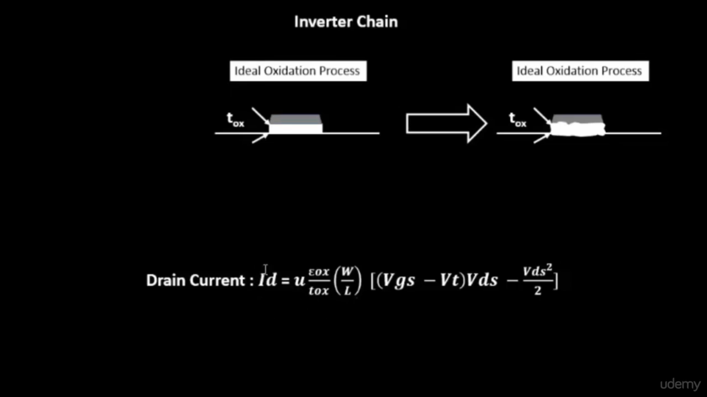
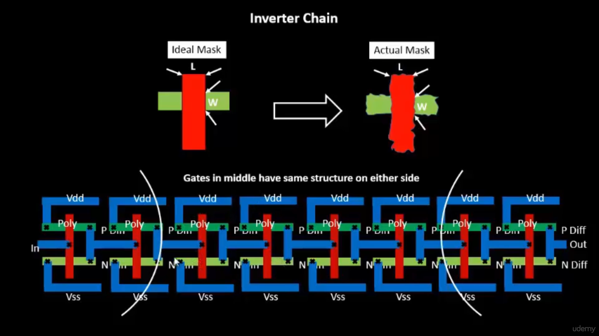
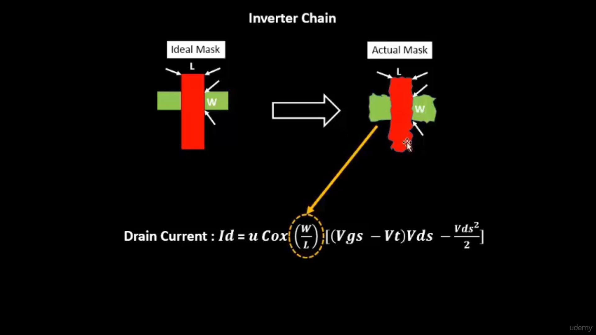
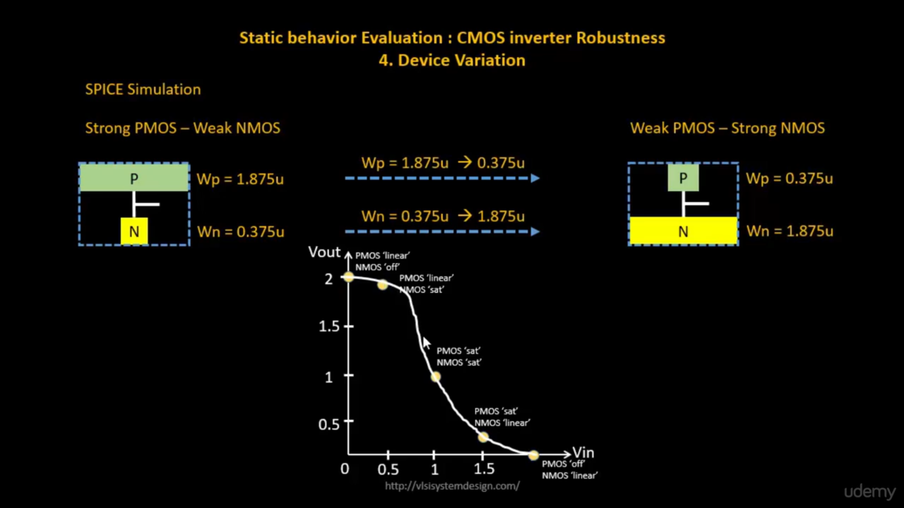
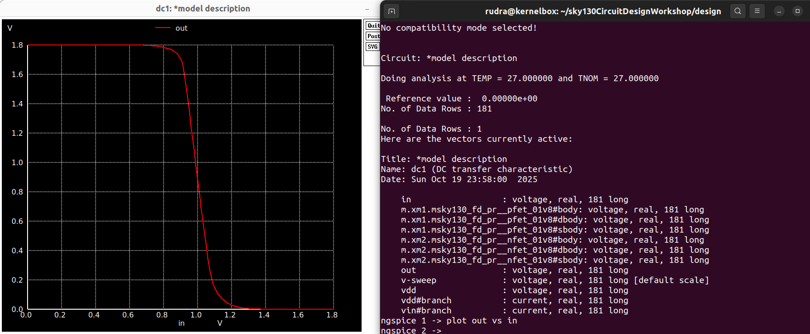

# CMOS Inverter Robustness — Power Supply Scaling and Source of Variation

This document discusses **static behavior evaluation** of CMOS inverters with respect to **power supply scaling**, **oxide thickness**, and **etching-induced device variations**.  

---

## ⚡ Power Supply Scaling

Power supply scaling refers to reducing the supply voltage (**VDD**) to improve power efficiency and reduce energy consumption in CMOS circuits. However, this scaling introduces certain performance trade-offs.

When the supply voltage decreases, the **drain current** and the **logic swing** reduce, but the energy consumption drastically improves.

### SPICE Simulation Result

The inverter DC transfer characteristics for different supply voltages are shown below:

As the supply voltage decreases, the switching threshold moves toward the lower voltage region, and the transition slope becomes steeper. The output swing also reduces proportionally to the decrease in **VDD**.

### Advantages of Lower Supply Voltage (Example: 0.5V)

1. **Increase in Gain** — nearly 50% improvement due to sharper transfer characteristics.  
2. **Significant Reduction in Energy** — up to 90% reduction in dynamic power, since power ∝ VDD².

### Disadvantages

1. **Performance Degradation** — reduced drive current leads to slower switching and higher delay.  
   This is a key consideration for low-power circuit design.

Below is the visualization from the SPICE simulation showing the benefits and trade-offs of power supply scaling:

  

---

## 🧩 Source of Variation

In real fabrication processes, transistors experience **physical variations** due to manufacturing limitations.  
Two major sources are **oxide thickness variations** and **etching inaccuracies**.

---

### 1. Oxide Thickness Variation

The **oxide thickness (tox)** determines the **gate capacitance (Cox)** and directly affects the **drain current (ID)** of the MOSFET.  
Any deviation from the ideal oxidation process changes the electrical behavior of the device.

The drain current equation can be expressed as:

\[
I_D = μ \frac{ε_{ox}}{t_{ox}} \frac{W}{L} [(V_{GS} - V_T)V_{DS} - \frac{V_{DS}^2}{2}]
\]

When **tox** increases, gate capacitance decreases, leading to reduced drive current.  
When **tox** decreases, capacitance increases, causing higher current but potential reliability issues.

#### Oxide Variation Visualization

  

---

### 2. Etching Variation

Etching determines the **width (W)** and **length (L)** of the transistor channel.  
Ideally, the lithography mask defines perfect dimensions, but real processes introduce imperfections — resulting in variation in W/L ratios.

Drain current depends on geometry as:

\[
I_D \propto \frac{W}{L}
\]

Thus, even small etching errors alter the current-driving capability and propagation delay of logic gates.

#### Etching Variation Visualization

  

Variations in W/L across multiple inverters cause delay mismatches and timing uncertainty in digital paths, impacting the overall robustness of CMOS circuits.

---

## 🔍 Finding Device Variations

Device variations can be identified using **SPICE simulations** by sweeping different W/L ratios and observing the **Voltage Transfer Characteristics (VTC)** of inverters.  
By comparing cases of **strong PMOS–weak NMOS** and **weak PMOS–strong NMOS**, one can visualize the shift in switching threshold.

#### Device Variation Visualization

  

When PMOS is stronger than NMOS, the switching threshold moves to the **right**, meaning a higher input voltage is needed to switch.  
When NMOS is stronger than PMOS, the threshold shifts **left**, meaning it switches earlier.  
These shifts indicate the **influence of transistor sizing** and **fabrication variability** on the inverter’s robustness.

---

## 🧠 Summary

- **Power supply scaling** improves energy efficiency but slows down the circuit.  
- **Oxide thickness variation** alters the gate capacitance, changing drive current and threshold voltage.  
- **Etching variation** affects the transistor dimensions, leading to W/L mismatches and delay variation.  
- **Device variation simulations** reveal how mismatch between PMOS and NMOS strengths shifts the inverter switching point.

---
