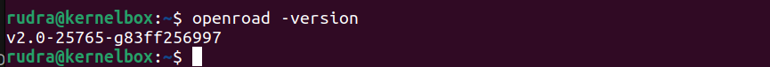

# OpenROAD — Build and Install from Source

This guide provides detailed steps to **build and install OpenROAD** from source on a Linux-based system (Ubuntu 20.04+ recommended).

---


## Prerequisites

For the installation of OpenROAD-flow-scripts, we can eighter build everything from source, or we can use the pre-built binaries.
- Here, we have used the second option of using pre-built binaries.
- To install OpenROAD-flow-scripts, we should have OpenROAD, Yosys and Klayout installed on our system.

- Yosys is already setup.

- Follow the below instructions to install Klayout and OpenROAD and then finally OpenROAD-flow-scripts

## Installation of Klayout.
```bash
sudo apt install klayout
```

- Also, verfify the version of Yosys (if not installed, install yosys also)
```bash
yosys -help
yosys -m slang -p "slang_version"
```


### Installation of OpenROAD

1. Clone the Repository (with Submodules)

```bash

git clone --recursive https://github.com/The-OpenROAD-Project/OpenROAD.git
cd OpenROAD

```

2. Install Dependencies

```bash
sudo ./etc/DependencyInstaller.sh -all
```

3. Create a Build Directory and Configure the Build with CMake

```bash
mkdir build
cd build
cmake ..
```

4. Build OpenROAD
```bash
make
```
  


5. Install OpenROAD System-Wide
```bash
sudo make install
```
  


### Verify the Installation

```bash
cd 
openroad
```
You should see the below message indicating a successful installtion

  

- Also, you can verify the version of OpenRoad used
```bash
openroad -version
```
  


## Installtion of OpenROAD-flow-scripts (ORFS)

1. Clone OpenROAD Flow Scripts

```bash
git clone https://github.com/The-OpenROAD-Project/OpenROAD-flow-scripts.git
cd OpenROAD-flow-scripts
```

2. Setup Environment Variables

```bash
# Path to OpenROAD binary
export OPENROAD_EXE=$(command -v openroad)

# Path to Yosys binary
export YOSYS_EXE=$(command -v yosys)

# Only if KLayout is built from source (otherwise skip)
export LD_LIBRARY_PATH="<klayout_location>/bin:$PATH"
```

- You can add these exports to your ~/.bashrc or ~/.zshrc for persistence.


3. Run the Flow

```bash
cd flow
make
```

  

```bash
make gui_final
```

  


# ORFS Directory Structure:

  

### Root Directory (`OpenROAD-flow-scripts/`)

| Folder / File | Description |
|----------------|--------------|
| **etc/** | Contains `DependencyInstaller.sh` and setup scripts for installing dependencies. |
| **tools/** | Source or binaries for EDA tools (OpenROAD, Yosys, OpenSTA, etc.). |
| **docker/** | Docker environment setup for running the flow in containers. |
| **dependencies/** | Stores locally built or downloaded tool dependencies. |
| **docs/** | Documentation for setup and usage. |
| **setup.sh** | Script to configure environment variables for the flow. |
| **build_openroad.sh** | Script to build the OpenROAD binary manually. |
| **README.md** | Main documentation for the repository. |
| **bazel**, **flake.nix**, **jenkins/** | Build and CI/CD system files (for developers). |

---

### Flow Directory (`flow/`)

| Folder / File | Description |
|----------------|-------------|
| **Makefile** | Main control file — runs the entire RTL-to-GDSII flow (`make`, `make gui_final`). |
| **designs/** | Example and user design directories (`gcd`, `aes`, etc.) with `config.mk`. |
| **platforms/** | Technology setup (PDK info like `sky130hd`, `nangate45`). |
| **scripts/** | Tcl scripts for synthesis, placement, routing, and signoff steps. |
| **results/** | Final design outputs — GDS, DEF, netlist, etc. |
| **reports/** | Timing, area, and power reports generated after each run. |
| **logs/** | Stage-wise execution logs for debugging. |
| **tutorials/** | Example walkthroughs for new users. |
| **util/** | Helper and utility scripts. |

---